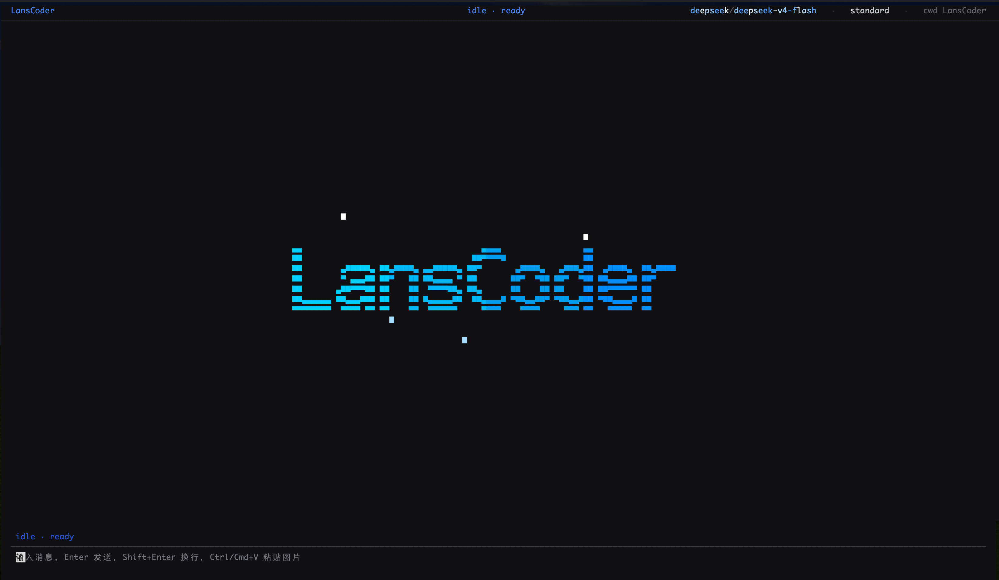

# LansCoder

> A local coding agent you can read end to end.

[](https://www.python.org/downloads/)
[](LICENSE)



## What is it?

LansCoder is a locally-runnable Python coding agent. It understands your codebase, edits files, and runs shell commands — like Claude Code or Aider. But its core design goal isn't feature volume; it's **understandability.**

~28,000 lines of Python, clean module boundaries, solid test coverage. Real enough to use daily, small enough to read from end to end.

96.38% reward pass@1 on the Harbor Aider Polyglot benchmark.

## Highlights

- **Small, so you can read it** — ~28k lines of Python, not 570k lines of TypeScript. Every module's job is obvious.
- **Built to learn from** — strict layering, clear dependency rules. Great for studying how coding agents work, for hacking on, or for interview prep.
- **Actually usable** — 29 built-in tools, multi-provider support, MCP integration, session persistence, context compression. Not a toy.
- **Preview before you write** — syntax-highlighted diffs shown before every file change, even in high-permission mode; confirmation via strict 1/2/3 input, with `reject: <feedback>` for write review.

## Quick start

Choose your preferred install method:

**Shell (one-liner, all platforms):**

```sh
curl -sSL https://raw.githubusercontent.com/Lanstzz/LansCoder/main/install.sh | bash
```

**pipx (all platforms):**

```sh
pipx install lanscoder
```

After installation, run `lanscoder config init` to generate a config file, then edit it with your API key:

- **macOS / Linux**: `~/.config/lanscoder/config.toml`
- **Windows**: `C:\Users\<username>\.config\lanscoder\config.toml`

Example config:

```toml
default_model = "deepseek/deepseek-v4-flash"

[providers.deepseek]
type = "openai-compatible"
base_url = "https://api.deepseek.com"
api_key = "sk-xxx"

[models."deepseek/deepseek-v4-flash"]
label = "DeepSeek V4 Flash"
context_window = 1000000

[permissions]
mode = "ask"

[ui]
theme = "default"
```

Then launch from your project directory:

```sh
lanscoder
```

Development setup:

```sh
python -m venv .venv
.venv/bin/python -m pip install -e ".[dev]"
.venv/bin/python -m pytest
```

## Features at a glance

| Capability | What it does |
|-----------|--------------|
| Coding agent | Understands code, edits files, runs shell commands, 29 built-in tools |
| Multi-model | OpenAI-compatible and Anthropic providers, hot-switchable mid-session |
| Permissions | Standard / aggressive / bypass modes, diff preview before every mutation; prompts answered with 1/2/3, `reject: <feedback>` on write review |
| TUI | Textual-based terminal UI; streams reasoning, tool calls, and results in real time, with nested collapsible transcript rows and per-reasoning durations |
| Sessions | Create, resume, fork, share — persisted as JSONL |
| Context compression | 4-level pipeline (L1–L4) to manage token usage in long conversations |
| Background subagents | Subagents run independently in the background, notify on completion |
| MCP integration | Connect external tool servers via Model Context Protocol |

## Architecture

```
lanscoder/
├── app/           Textual TUI
├── agent/         Agent loop, tool execution, permission resume
├── providers/     Model provider adapters
├── tools/         Tool registration and execution (29 built-in tools)
├── permissions/   Policy, grants, and permission coordinator
├── context/       Event log and context management
├── session/       Session lifecycle
├── planning/      Task plan service and projection
├── subagent/      Background subagent types
├── input/         Attachments and clipboard
├── mcp/           MCP protocol integration
├── memory/        Cross-session persistent memory
├── skills/        Local skill discovery and loading
├── config/        TOML configuration
└── utils/         Shared utilities
```

## Who is it for?

- Developers who want to **deeply understand how coding agents work**
- People looking to **extend or modify** a Python-based coding agent
- Anyone who needs **a project they can explain architecturally** for interviews or portfolios
- AI enthusiasts who want to **experiment with different models** locally

## Contributing

Issues and PRs are welcome. Tests cover most core modules — please make sure they pass before submitting.

## License

MIT