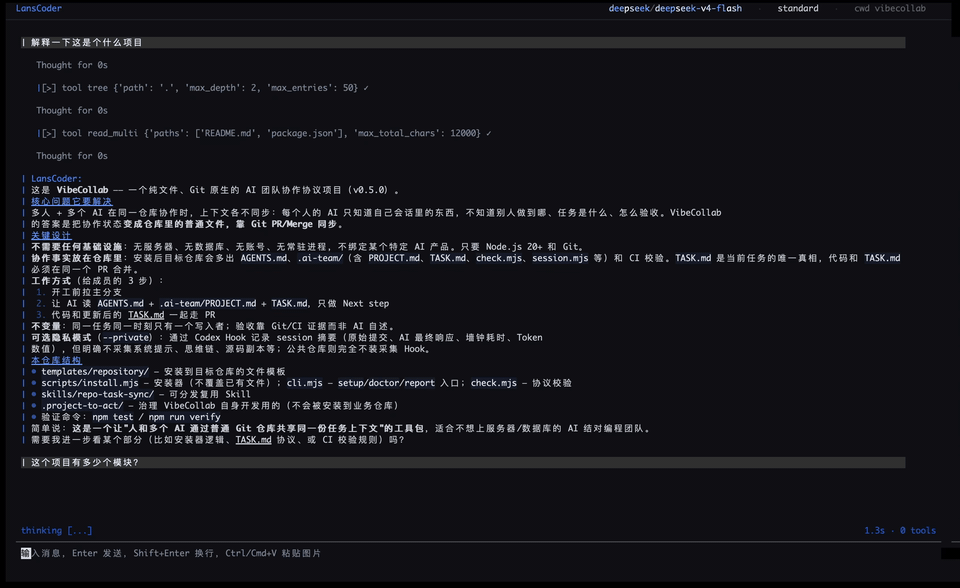

# LansCoder

[English](README.en.md) · [PyPI](https://pypi.org/project/lanscoder/) · [更新日志](#更新日志)

> **一个可以从头读到尾的 AI 编程代理** —— 目标不是在一个更大的 agent 面前堆功能，而是让系统**真实可用**，同时**小到能通读**，并理解每个子系统为什么存在。



---

## 这是什么

LansCoder 是一个在终端里运行的 AI 编程代理。像 Claude Code 或 Aider 一样，它能理解你的代码库、编辑文件、运行命令；但它的代码只有 **约 2.9 万行 Python**，分布在 15 个职责清晰的模块里——从入口、代理循环到工具系统，你可以完整地读一遍，并看懂每一层在做什么。

它不是玩具：**33 个内置工具**、OpenAI 兼容 + Anthropic 双模型适配、MCP 集成、会话恢复与分支，以及 L1–L3 上下文压缩管线。历史 Harbor 结果仅是特定本地锁定配置下的外部 benchmark 证据。

**核心承诺**：目标不是比一个更大的 agent 功能更多，而是保持系统真实可用的同时，小到足以通读——理解每个子系统为什么存在。

---

## 为什么值得读

### 与大型生产级 agent 相比

| 维度 | LansCoder | 大型生产级 agent（如 Claude Code / OpenCode） |
|------|-----------|----------------------------------------------|
| 首要目标 | 让 agent 内部机制**可读、可教** | 交付更完整的生产级 agent 平台 |
| 代码规模 | ~29k 行 Python（204 文件 · 15 模块） | 约 57 万行（Claude Code ≈ 570k 行 TypeScript；OpenCode ≈ 575k 行 TS/JS） |
| 工程取舍 | 主动砍掉部分平台面，保持**可检查性** | 接受更高复杂度，支撑更广产品面 |
| 适合谁 | 学习、二次开发、本地实验 | 需要更大、更完整 agent 环境的用户 |

---

## 快速上手

**一键安装（macOS / Linux / Windows Git Bash）**：

```sh
curl -sSL https://raw.githubusercontent.com/Lanstzz/LansCoder/main/install.sh | bash
```

**或通过 pipx 安装**：

```sh
pipx install lanscoder
lanscoder config init
```

编辑配置文件，填入你的 API 密钥：

- **macOS / Linux**：`~/.config/lanscoder/config.toml`
- **Windows**：`C:\Users\<用户名>\.config\lanscoder\config.toml`

```toml
[providers.deepseek]
type = "openai-compatible"
base_url = "https://api.deepseek.com"
api_key = "你的 API key"
parallel_tool_calls = true

[models."deepseek/deepseek-v4-flash"]
label = "DeepSeek V4 Flash"
context_window = 1000000

[permissions]
mode = "ask"

[ui]
theme = "default"
```

然后在工作目录启动：

```sh
lanscoder
```

---

## SDK 集成(`lanscoder-core`)

不想用 TUI、只想把 LansCoder 的核心能力嵌入自己的程序?`lanscoder.core` 是独立 headless SDK,
以分发包 **`lanscoder-core`** 发布(dist 名 ≠ import 名,import 仍是 `lanscoder`),必装依赖仅
`anyio` / `portalocker` / `PyYAML`,**不带 TUI**:

```sh
pip install lanscoder-core              # 最小集,无 TUI
pip install "lanscoder-core[llm]"       # + openai / anthropic
pip install "lanscoder-core[llm,mcp]"   # + openai / anthropic / mcp
```

```python
from lanscoder.core import Agent, LoopConfig, LoopContext

# transport: duck-typed LlmTransport(2 方法 + 3 属性),见 examples/sdk/minimal_llm_transport.py
agent = Agent(
    context=LoopContext(system_prompt="你是 headless agent。"),
    config=LoopConfig(provider=transport, session_id="sdk-demo"),
)
await agent.prompt("你好")  # 需在 async 上下文中运行;完整可运行示例见 examples/sdk/
```

- 三层 API(L1 `agent_loop` / L2 `Agent` / L3 `create_agent_session`)与可运行示例见
  [docs/architecture/03-sdk.md](docs/architecture/03-sdk.md) 与 [examples/sdk/](examples/sdk/)。
- `LansCoder`(TUI 应用)是**薄壳**:它依赖 `lanscoder-core[llm,mcp]` + TUI 侧依赖,与 SDK 是
  **依赖关系而非替代关系**——装 `LansCoder` 自动带上 core,两个包文件零重叠。
- 发布/Test PyPI 演练清单见 [docs/publishing.md](docs/publishing.md)。

---

## 评测与回归

旧的独立评测 harness 已移除；它不再是本仓库支持的评测或回归路径。

---

## 功能概览

| 能力 | 说明 |
|------|------|
| 编程代理 | 理解代码、编辑文件、运行命令，33 个内置工具按权限分级 |
| 多模型 | OpenAI 兼容 + Anthropic 适配器，会话内热切换模型 |
| 权限控制 | 标准 / 宽松 / 放行三种模式，写前 diff 预览、敏感路径询问、持久授权 |
| TUI 界面 | Textual 构建的终端界面，实时展示推理、工具调用与结果 |
| 会话管理 | 创建、恢复、分支、分享会话，JSONL 持久化，断点续跑 |
| 上下文压缩 | L1–L3 四级压缩管线，控制长会话 token 消耗 |
| 后台子代理 | 子代理后台独立运行、完成后通知，支持并行任务与 worktree 隔离 |
| 持久记忆 | 跨会话 recall，项目级 / 用户级作用域 |
| skill系统 | 本地技能文件发现与加载 |
| MCP 集成 | 连接外部 MCP 工具服务器（stdio / SSE） |

---

## 技术架构

```
┌────────────────────────────────────────────────────────────┐
│                    表现层 · app/ (Textual TUI)              │
│      转录视图 · 权限视图 · 子代理面板 · 模型切换 · 斜杠命令        │
└──────────────────────────┬─────────────────────────────────┘
                           │
┌──────────────────────────┴─────────────────────────────────┐
│                   编排层 · agent/                           │
│  代理循环 · 回合协议 · 工具流 · 子代理引擎 · 权限协调 · 护栏        │
└───────┬──────────────────────────────┬─────────────────────┘
        │                              │
┌───────┴──────────┐        ┌──────────┴──────────────┐
│  能力层 · tools/  │        │  能力层 · permissions/  │
│  33 个内置工具     │        │  策略 · 单一执法闸门      │
│  （工具与权限互不知晓，agent 是唯一协调者）              │
└───────┬──────────┘        └──────────┬──────────────┘
        └──────────────┬───────────────┘
                       │
┌──────────────────────┴──────────────────────────────────┐
│              横切层 · 基础设施                            │
│  providers/  模型适配（OpenAI · Anthropic）               │
│  context/    事件日志 · 上下文构建 · L1–L3 压缩            │
│  session/    会话生命周期 · JSONL 持久化 · 恢复/分支        │
│  mcp/ memory/ skills/ planning/ config/ input/ subagent/ │
└─────────────────────────────────────────────────────────┘
```

### 技术栈

| 层级 | 技术 |
|------|------|
| 运行时 | Python 3.11+ · anyio 异步 |
| 终端 UI | Textual |
| 模型适配 | OpenAI SDK（兼容接口）· Anthropic SDK |
| 工具集成 | MCP（stdio / SSE） |
| 持久化 | JSONL 会话存储 · TOML 配置（tomlkit）· portalocker |
| 质量 | pytest（127 文件 / 3.7 万行测试）· trio · ruff · black · 依赖方向 AST 门禁 |
| 发布 | PyPI · pipx · 一键安装脚本 |

---

## 文档

完整文档见 [docs/](docs/)：

- [快速开始](docs/getting-started/) — 安装、配置、5 分钟跑通
- [能力指南](docs/guides/) — 权限模型、上下文压缩、会话管理
- [架构](docs/architecture/) — 分层设计与依赖规则
- [FAQ](docs/faq.md) — 常见问题
- [发布检查](docs/publishing.md) — `LansCoder` + `lanscoder-core` 双 dist 发布清单(Test PyPI → 真实 PyPI)

---

## 适合谁

- 想**深入理解 Coding Agent 内部原理**的开发者
- 想基于 Agent Harness **做二次开发**的人
- 准备面试、需要**能讲清楚架构**的项目

---

## 开发

```sh
python -m venv venv
venv/bin/python -m pip install -e packages/lanscoder-core
venv/bin/python -m pip install -e ".[dev]"
venv/bin/python -m pytest      
venv/bin/python -m ruff check .
```

贡献指南见 [docs/development.md](docs/development.md)。

---

## 更新日志

完整变更历史见 [CHANGELOG.md](CHANGELOG.md)(keep-a-changelog)。

### v1.2.1 (2026-08)

- **TUI 品牌化**：统一深色配色、建议框与活动行对齐
- **转录重构**：嵌套可折叠回合模型，live 与重放渲染顺序一致
- **权限体验**：修复暂停/恢复错序，权限提示移入瞬时按钮区，恢复严格 1/2/3 输入
- **后台通知**：持久化通知标签与错误信息，退出前冲刷待发通知
- **权限执法解耦**：PermissionCoordinator 成为单一执法闸门，tools 层对 permissions 零引用，移除 `runtime/` 包
- **架构门禁**：依赖方向端到端测试锁定包边界

### v1.1.0 (2026-08)

- **同步/异步统一**：非流式回合收敛到统一异步核心，删除旧同步分支
- **子代理面板**：后台子代理选择、高亮与停止交互
- **worktree 隔离**：子代理可在隔离 git worktree 中运行且可取消
- **子代理可观测**：delegate 结果上报 token 用量与耗时
- **工程化**：ruff / black 纳入 dev 依赖

### v1.0.1 (2026-08)

- **压缩管线 v3/v4**：LLM 摘要压缩（保留最近 N 轮原文）、hard-truncate 兜底、压缩策略版本化

### v1.0.0

- 首个稳定版本：核心代理循环、Textual TUI、工具系统、会话持久化、上下文管理

---

## 项目声明

- 这是可运行的个人工程项目，不代表已完成的规模化市场验证。
- 仓库不包含生产环境密钥；请从示例配置创建本地配置。

## License

[MIT](LICENSE)
